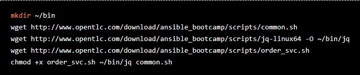
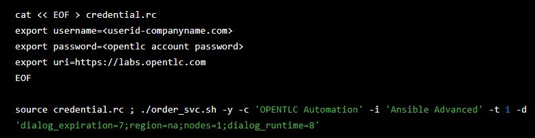

## Provision QA Environment

1.	SSH to Bastion 

2.	Copy opentlc user account private  key file to Bastion

3.	Verify the SSH connectivity to workstation machine using opentlc user account

4.	clone https://github.com/syntbots/ansible_advance_homework.git  to bastion root

5.	Set the Environment Variables

	```
	export OSP_GUID=xxxx
	```
6.  Execute site-setup-workstation.yml
      *  Public network named ext_network will be created
      *  Private network named int_network will be created
      *  Security group to allow services running in RHOSP  instances accessible from workstation
      *	 Custom hardware profile for creating RHOSP instances
      *  Key pair named ansible_ssh for attaching to RHOSP instances
      *	 Custom image named rhel_image will be created to provision RHOSP instances
      *	 SSH connectivity using cloud-user account between bastion and workstation using openstack keys files
      *	 Setup workstation as isolation node ; instance group osp will be created

7.	Execute site-osp-instances.yml play book which invokes osp-servers  role to provision RHOSP instances

8.	Site-3tier-app.yml will install services as follows
      *	Haproxy in frontend 
      *	Tomcat in app1 and app2
      *	Postgres in appdb1

9.	Execute site-smoke-osp.yml playbook to run smoke test on QA environment

10.	If QA setup is done properly smoke test will be success.


## Provision PROD Environment

1-4.	Follow step 1 – 4 as in QA setup 

5.	Run order_svc file which will do AWS provision. Below are the steps 
        
	
     
6.	Executing 3tier app prod will install services as follows
	* Haproxy in frontend 
	* Tomcat in app1 and app2
	* Postgres in appdb1

7.	Execute aws_status_check.yml  playbook to verify that services are up and running 

8.	Execute  site-smoketest-aws.yml play book  to smoke test on PROD environment

9.	If PROD setup is done properly smoke test will be success.

## Design Ansible Tower Workflow
SSH to  Bastion
Change to cloned repo directory
Set the environment variables
export TOWER_GUID=xxxx
export OSP_GUID=xxxx
export OPENTLC_LOGIN=xxxxxxxxxxxxxxx
export OPENTLC_PASSWORD=xxxxxx
export GITHUB_REPO=https://github.com/syntbots/ansible_advance_homework
export JQ_REPO_BASE=http://www.opentlc.com/download/ansible_bootcamp
REGION=us-east-1
RH_MAIL_ID=xxxxxxxxxxxxxxx

Execute site-config-tower play book to setup job and workflow templates to provision and run services in QA and PROD environments 
Dynamic inventory  to fetch EC2 instance’s facts will be created; It  uses tag:instance_filter=three-tier-app-jaya-venkatesan-atos.net
Read Only AWS-credentials are created to run dynamic inventory


